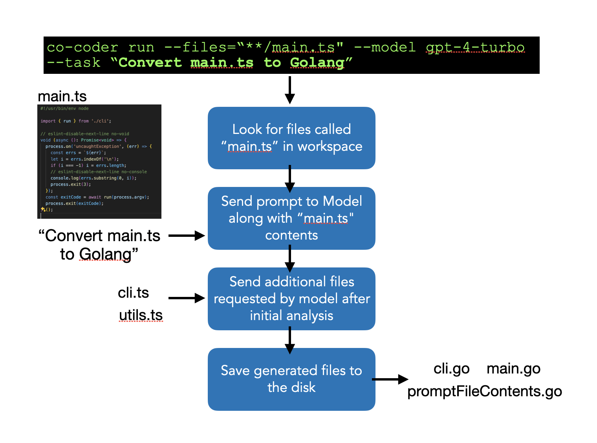

# co-coder

This library aim making LLM engines able to generate files in the context of a project, not only for generating pieces of code for specific problems, but to reason what is the project structure, architecture, conventions and to create new files or update existing ones to solve a certain task.

See [examples/](/examples/) folder for a showcase

## Concepts

Co-coder will help adding files from your workspace to prompts and saving the generated files to local disk. It will also add to the prompts some concepts about how a good software engineer should work with the files while handling the task you send to it.

By adding "info" and "example", you can prepare the tool to be used for different "tasks" in the same project, such as generating more complex boilerplates, creating documentation or migrating parts of a project to another language.

The difference between Gihub Co-Pilot and Co-coder is that you can use more advanced OpenAI models with much larger contexts to process more complex tasks that involves the entire workspaces, for example. For simple tasks, Co-Pilot is the way to go.



## Usage

### CLI tool

```
npx co-coder run --task <task description> --workspace <workspace dir> [options]
```

```
co-coder run

Run a task in the context of workspace files and possibly generate new files
based on the prompt

Options:
  --version        Show version number     [boolean]
  --help           Show help      [boolean]
 -t, --task        Task to be performed in the context of the
                   workspace files  [string] [required]
 -b, --base-dir    Base directory with workspace files
                   [string] [default: "."]
 -f, --files       Regex for file names that will have its
                   full content included in the prompt. e.g.
                   "src/.*\.ts"   [array] [required]
 -p, --preview     Regex for file names that will have its
                   partial content included in the prompt
                   [array]
 -e, --example     Instruction with an example of the task to
                   be performed, or a path to a file that
                   should be used as an example   [string]
 -i, --info        General information about the workspace
                   structure, standards, and other relevant
                   information to be included in the prompt
                   [string]
 -m, --model       Model to be used. e.g. "gpt-4o",
                   "gpt-3.5-turbo-0125". If using Azure, must
                   match the custom deployment name you chose
                   for your model   [string] [required]
 -o, --output      Output directory for generated files by
                   the prompt   [string] [default: ".out"]
 --max-tokens-total, --tt  Max number of tokens allowed to be used in
                           total for the task
                           [string] [default: "4000"]
 --max-tokens-per-request, --tr  Max number of tokens to send to the API in
                                 a single request
                                 [string] [default: "128000"]
 --api-provider   API provider. One of "openai" or "azure"
                  [string] [default: "openai"]
 --api-url        API url. e.g. "https://localhost:1234". If
                  using Azure, it's required to use the
                  endpoint URL from Azure     [string]
 --api-auth       API auth method. One of "token" or
                  "apikey" [string] [default: "apikey"]
 --api-key        OpenAI API key     [string]
 --api-azure-version    Azure API version. Required when using
                         Azure provider
                         [string] [default: "2024-02-01"]
```

Run `npx co-coder --help` for a complete documentation

### Examples

Here are a few examples of how to use the CLI tool:

```sh
npx co-coder run --task "refactor code" --files "**/*.ts"
```

This command will run the prompt "refactor code" over .ts files in the current dir and output its results to folder ".out"

```sh
npx co-coder run --task "generate unit tests" --files "src/app.ts" --output "."
```

This command will generate unit tests for the file src/app.ts in the workspace

```sh
npx co-coder run --task "fix any bugs in these files" --files "src/*.ts" --model "gpt-3.5-turbo-0125"
```

This command will fix bugs in all TypeScript files in the `src` directory using the `gpt-3.5-turbo-0125` model.

```sh
npx co-coder run --task "generate documentation for these files in docs.md" --files "src/**/*.ts" --output "docs"
```

This command will generate documentation for all TypeScript files in the `src` directory and output the generated files to the `docs` directory.


## Tricks

Here are some prompts used for more complex or in depth tasks

### Code migration

Run two separate prompts. One for generating an ordered list of files to be migrated, and another to do the actual migration. We tried to do it in a single prompt but the model keeps "forgetting" to migrate all the files, or does only partial migrations.

- Run Prompt 1: Traverse the code dependencies starting from main.ts and save the list of files that should be migrated to Golang from the least dependant to the most dependant module to plan.txt

- Run Prompt 2: Migrate all files listed in plan.txt to Golang following the order in the list.

## Learnings

### ChatGPT 4

* Prompts that involves generating too many files tend to be poorly implemented (with lots of "TODOs" or incomplete contents in the files). We couldn't find a way to "force" to model to not be lazy, but we know it's capable of doing more complex things because "sometimes" it's able to generate amazing results (complete and correct).

